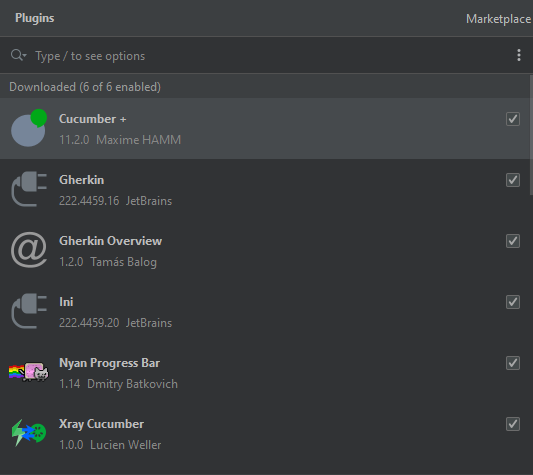

# PROYECTO AUTOMATION WEB
Utilizando selenium con python, probaremos el login de https://www.saucedemo.com/.
El proyecto contiene 2 casos, 1 que de en error y otro que pase correctamente.

> Navegador: En `--environment.py`, linea 5, se puede configurar a eleccion el driver.


## Tener instalado para correr el código

| Instalar                |
|-------------------------|
| [Behave]                |
| [Selenium]              |
| [allure-behave]         |
| [behave-html-formatter] |
| pip                     | 
## Plugins utilizados en PyCharm


 ## COMANDOS PARA EJECUTAR

### Para ejecutar con Behave común `--no genera reporte`:
```sh
behave ./features
```

### Para ejecutar con Junit `--no genera reporte`:
```sh
behave --junit 
```

## Pasos para generar reportes (Behave):
Corre directamente con el runner que contendrá la información, se le pasa el feature y direccion por comando.

#### > Condiciones: Tener instalado [behave-html-formatter]

```sh
py features/runner.py --testdir=features
```
 
> Link de interés para saber sobre reportes en Behave https://behave.readthedocs.io/en/stable/formatters.html

## Pasos para generar reportes (Allure)


| Tener instalado | Documentacion                                                   |
|-----------------|-----------------------------------------------------------------|
| Scoop           | https://github.com/ScoopInstaller/Install#advanced-installation |
| Allure          | https://docs.qameta.io/allure/#_how_to_proceed                  |
Tutoriales para instalar:
> Instalar Scoop: https://www.youtube.com/watch?v=p9-wnf5RWC8
> 
>Allure: https://www.youtube.com/watch?v=3WuTSDkfuqQ
> 
> Solucion si no puede instalar scoop: https://www.youtube.com/watch?v=gm0gexHWDy0
> 


Para correr el código y generar el reporte en formato JSON:


```sh
behave -f allure_behave.formatter:AllureFormatter -o report ./features
```

Para pasar el reporte a HTML:
```sh
 allure serve report
 ```


[//]: # (These are reference links used in the body of this note and get stripped out when the markdown processor does its job. There is no need to format nicely because it shouldn't be seen. Thanks SO - http://stackoverflow.com/questions/4823468/store-comments-in-markdown-syntax)

[Behave]: <https://pypi.org/project/behave/>
[Selenium]: <https://pypi.org/project/selenium/>
[allure-behave]: <https://pypi.org/project/allure-behave/>
[behave-html-formatter]: <https://pypi.org/project/behave-html-formatter/>